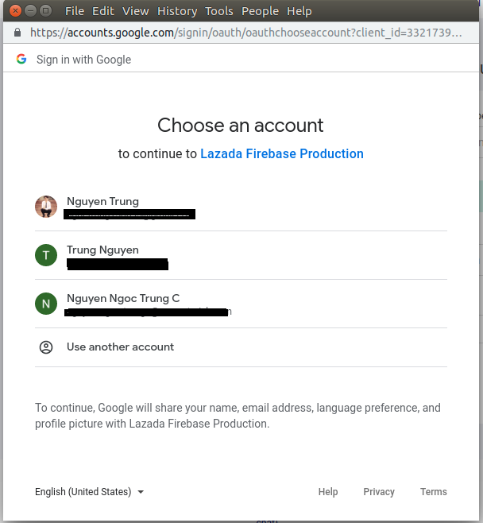
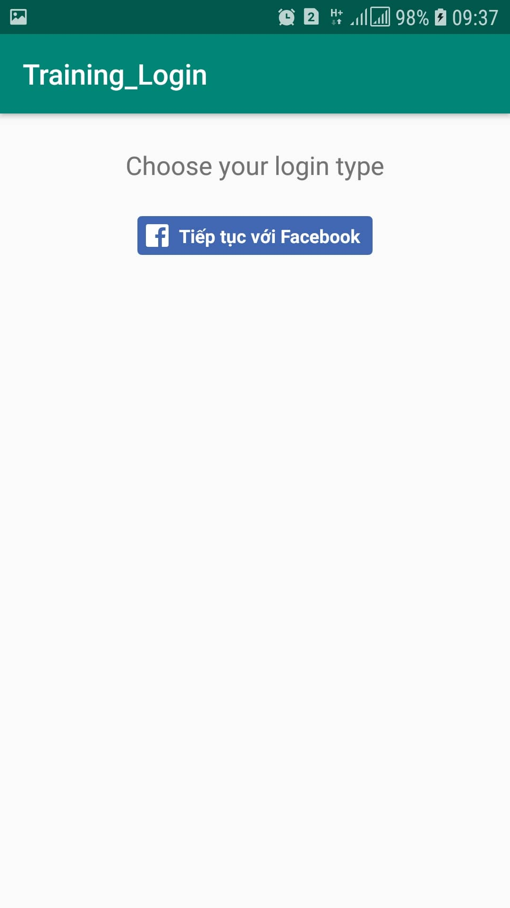
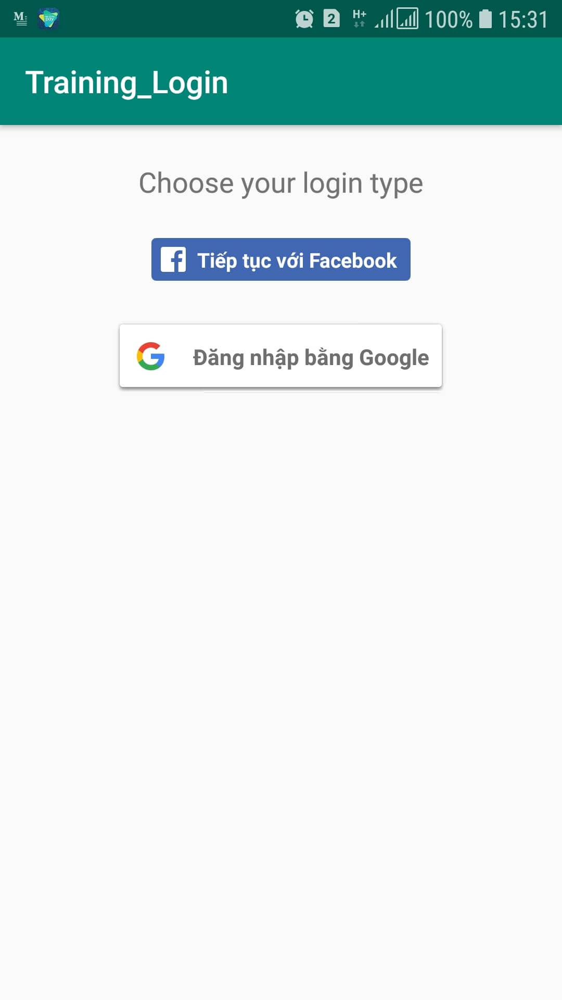
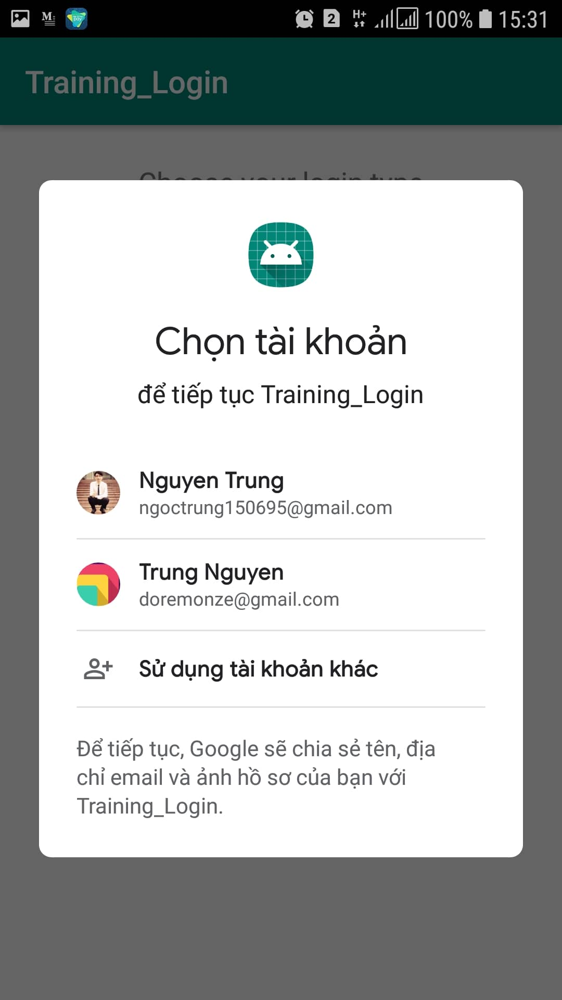
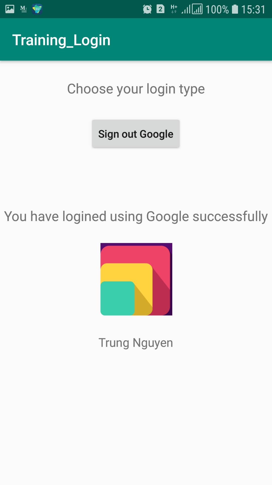

# Training_OAuth2_Fb_Google_Login

## I. OAuth 2

### 1. Các khái niệm

### a. Mở đầu

Về cơ bản thì oauth là một phương thức chứng thực, mà nhờ đó một web service hay một application bên thứ 3 có thể đại diện cho người dùng để truy cập vào tài nguyên người dùng nằm trên một dịch vụ nào đó. 

Các trào lưu cũng như sự lan rộng của khái niệm OAuth bắt đầu khi mà các dịch vụ mạng xã hội như twitter hay facebook nở rộ, đặc biệt khi các công ty như twitter cung cấp API cho bên thứ 3 để có thể truy cập vào tài nguyên của người dùng, qua đó mở nên một thị trường mới gọi là 3rd party app, ví dụ như tweetdeck hay hootsuite. Chính nhờ OAuth mà ta có thể đăng nhập, tạo tài khoản trên các ứng dụng giải trí (phim, game, nhạc, ...), mua sắm (tiki, lazada, shoppe), ... mà ko cần mất thời gian tạo tài khoản.

### b. OAuth là gì ?

Là một phương thức chứng thực giúp các ứng dụng có thể chia sẻ tài nguyên với nhau mà không cần chia sẻ 
**username** và **password**. Từ Auth mang hai nghĩa:

- **Authentication**: xác thực người dùng thông qua việc đăng nhập.

- **Authorization**: cấp quyền truy cập vào các Resource.

### c. Lịch sử

- Năm 2006, Twitter đưa ra chuẩn OAuth đầu tiên có tên là OpenID, điểm yếu đó là yêu cầu người dùng phải cung cấp thông tin cá nhân (username + password).

- Năm 2010, phát hành phiên bản chính thức đầu tiên của Oauth 1.0 (RFC 5849).
Sau đó lỗi bảo mật nghiêm trọng được phát hiện với tên gọi Session Fixation cho phép Hacker chiếm quyền truy cập vào tài nguyên của người dùng.

- Năm 2012, OAuth2 ra đời, tuy vẫn còn những lỗi bảo mật như dùng Chrome để Hack Facebook nhưng hiện vẫn đang được sử dụng khá rộng rãi.

OAuth2 không đơn thuần chỉ là giao thức kết nối, nó là một "nền tảng" mà chúng ta phải triển khai ở cả hai phía: Client và Server

### d. Các thành phần và luồng hoạt động trong OAuth 2

Có 4 thành phần:

- Resource Owner (User)

- Client (Application)

- Resource Server (API)

- Authorization Server (API)

Luồng hoạt động


1. Application yêu cầu ủy quyền để truy cập vào Resource Server thông qua User


2. Nếu User ủy quyền cho yêu cầu trên, Application sẽ nhận được giấy ủy quyền từ phía User (dưới dạng một token string nào đó chẳng hạn)



3. Application gửi thông tin định danh (ID) của mình kèm theo giấy ủy quyền của User tới Authorization Server

4. Nếu thông tin định danh được xác thực và giấy ủy quyền hợp lệ, Authorization Server sẽ trả về cho Application access_token. Đến đây quá trình ủy quyền hoàn tất.

5. Để truy cập vào tài nguyên (resource) từ Resource Server và lấy thông tin, Application sẽ phải đưa ra access_token để xác thực.

6. Nếu access_token hợp lệ, Resource Server sẽ trả về dữ liệu của tài nguyên đã được yêu cầu cho Application.

### e. Đăng kí thông tin cho ứng dụng

Trước khi sử dụng Oauth cho ứng dụng, bạn phải đăng ký ứng dụng với bên cung cấp dịch vụ, một số thông tin cơ bản cần đăng ký như sau:

- Tên ứng dụng (Application Name)


- Website của ứng dụng (Application Website)


- Redirect URI hoặc Callback URL: chính là địa chỉ sẽ quay về sau khi quá trình ủy quyền hoàn tất (cho phép hoặc từ chối từ phía User), chính vì thế mà địa chỉ quay về đó chính là nơi bạn sẽ phải thực hiện xử lý cho authorization codes hoặc access tokens.

### f. Client Id và Client Secret

Khi ứng dụng của bạn được đăng ký, bên dịch vụ sẽ phát hành "thông tin chứng thực client" (client credentials) cho bạn bao gồm thông tin:

- **Client Identifier**: là một chuỗi ký tự được sử dụng bởi Service API để định danh ứng dụng, đồng thời cũng được dùng để xây dựng "authorization URL" hiển thị phía User.


- **Client Secret**: là một chuỗi ký tự được sử dụng để xác thực định danh (ID) của ứng dụng khi ứng dụng yêu cầu truy cập thông tin tài khoản của User. Chuỗi này được giữ bí mật giữa Application và API.

### g. Authorization Grant

Có 4 loại Grant trong OAuth 2

- **Authorization Code**: sử dụng với các server-side Application.

- **Implicit**: sử dụng với các Mobile App (ứng dụng chạy trên thiết bị của User) hoặc Web App (có thể hiểu là Browser App cũng được, VD: Chrome Extension).

- **Resource Owner Password Credentials**: sử dụng với các Trusted Application, kiểu như những ứng dụng của chính Service.

- **Client Credentials**: sử dụng với các ứng dụng truy cập thông qua API.

## II. Login sử dụng Facebook

Sử dụng tài khoản facebook để có thể tạo tài khoản, đăng nhập trên ứng dụng khác

Các bước thực hiện

1. Nhấn tạo ứng dụng


Sẽ xuất hiện bảng


2. Chọn sản phẩm


Xong sẽ xuất hiện ra như sau


3. Làm theo các bước như sau


Ta sẽ được app




## III. Login sử dụng Google

Các bước thực hiện

1. Add google maven in build.gradle in project's top-level

```
allprojects {
    repositories {
        google()

        // If you're using a version of Gradle lower than 4.1, you must instead use:
        // maven {
        //     url 'https://maven.google.com'
        // }
    }
}
```

Add Google Play service

```
apply plugin: 'com.android.application'
    ...

    dependencies {
        implementation 'com.google.android.gms:play-services-auth:17.0.0'
    }
```
2. 

Add a project 


Điền thông tin


3. Configure Google Sign-in và GoogleSignInClient object

```
// Configure sign-in to request the user's ID, email address, and basic
// profile. ID and basic profile are included in DEFAULT_SIGN_IN.
GoogleSignInOptions gso = new GoogleSignInOptions.Builder(GoogleSignInOptions.DEFAULT_SIGN_IN)
         .requestId()
         .requestProfile()
         .requestScopes()
         .build();

mGoogleSignInClient = GoogleSignIn.getClient(this, gso);
```

4. Thêm nút Sign-in with Google

```
<com.google.android.gms.common.SignInButton
 android:id="@+id/sign_in_button"
 android:layout_width="wrap_content"
 android:layout_height="wrap_content" />
```
 


Có thể thay đổi size cho button: SIZE_STANDARD, SIZE_WIDE, SIZE_ICON_ONLY

5. Bắt sự kiện cho nút 

```

@Override
public void onClick(View v) {
    switch (v.getId()) {
        case R.id.sign_in_button:
            signIn();
            break;
        // ...
    }
}

private void signIn() {
    Intent signInIntent = mGoogleSignInClient.getSignInIntent();
    startActivityForResult(signInIntent, RC_SIGN_IN);
}


```

6. Lấy thông tin về và xử lý

```
@Override
public void onActivityResult(int requestCode, int resultCode, Intent data) {
    super.onActivityResult(requestCode, resultCode, data);

    // Result returned from launching the Intent from GoogleSignInClient.getSignInIntent(...);
    if (requestCode == RC_SIGN_IN) {
        // The Task returned from this call is always completed, no need to attach
        // a listener.
        Task<GoogleSignInAccount> task = GoogleSignIn.getSignedInAccountFromIntent(data);
        handleSignInResult(task);
    }
}
```

7. Update UI

```
private void handleSignInResult(Task<GoogleSignInAccount> completedTask) {
    try {
        GoogleSignInAccount account = completedTask.getResult(ApiException.class);

        // Signed in successfully, show authenticated UI.
        updateUI(account);
    } catch (ApiException e) {
        // The ApiException status code indicates the detailed failure reason.
        // Please refer to the GoogleSignInStatusCodes class reference for more information.
        Log.w(TAG, "signInResult:failed code=" + e.getStatusCode());
        updateUI(null);
    }
}
```

Kết quả: 








